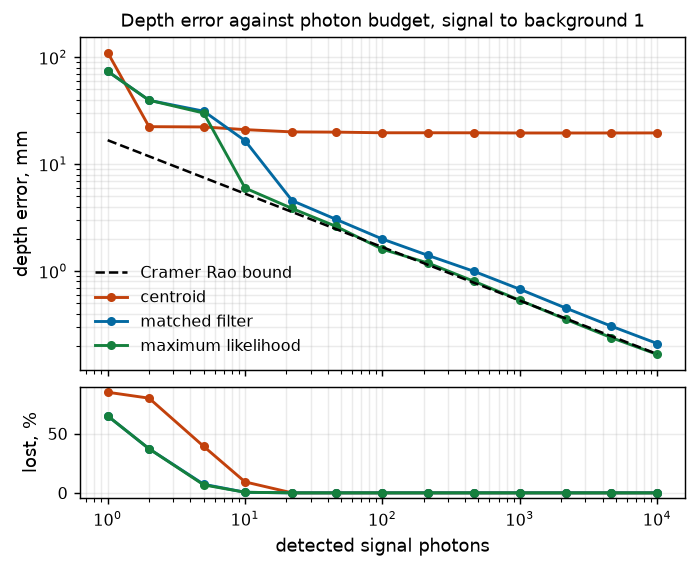

# photon-counting-lidar

[](https://github.com/andrealo20/photon-counting-lidar/actions/workflows/ci.yml)
[](LICENSE)
[](https://en.wikipedia.org/wiki/C99)
[](tests/)
[](.github/workflows/ci.yml)
[](#memory)

**Depth estimation from single photon arrival times, with the detector modelled
as it behaves and every estimator measured against the Cramer Rao bound.**

A lidar that counts single photons never sees a waveform. Each laser pulse
returns one timestamp at best and usually nothing, so the distance exists only
as a statistic built up over millions of pulses.



The instrument response is 152 ps wide, worth 23 mm of range on its own.
Maximum likelihood reads the distance to 0.17 mm from ten thousand photons and
holds the bound over three decades. Below ten photons it stops, for a reason
worth showing rather than hiding.

## The model

Detected photons within a repetition period are an inhomogeneous Poisson
process of rate

```
lambda(t) = eta * ( S * irf(t - t0) + B )
```

with t0 = 2d/c the time of flight, S the signal photons a cycle delivers, B the
ambient and dark count rate, and eta the detection efficiency. Counts over M
cycles are Poisson with mean M*mu_i. Four properties of a real detector are in
the model, and each one moves the answer:

- **An asymmetric response**, a Gaussian core from jitter plus an exponential
  tail from carriers that arrive by diffusion. That tail is why the centroid
  curve flattens at 19.6 mm however many photons arrive: a bias, not noise.
- **One record per cycle**, so early photons mask late ones and the distance
  comes out short. Coates published the exact inverse in 1968.
- **Dead time**, tens of nanoseconds against a hundred nanosecond period, so it
  carries across cycle boundaries. Paralyzable and non paralyzable both.
- **Afterpulsing**, spurious counts correlated with an earlier detection.

## Verification

Nothing below compares an estimator with itself.

**The simulator exists twice.** One path works from the response distribution
function and the closed form for pile up. The other draws photons per cycle,
places each from the construction of the distribution, and runs them through
the detector. The second never evaluates the distribution function or the
density, so a Pearson statistic between the two tests the closed forms rather
than two spellings of one routine. It has to land within five standard
deviations of its degrees of freedom.

A gate is only worth its power to fail, so that is measured too. At six percent
of cycles recording, deleting the pile up term outright moves the statistic by
4.3 standard deviations and would pass, so one case runs at 36 percent, where
the same error moves it by 987. Both the agreement and the control are
asserted.

**The pile up inverse round trips** to twelve significant figures at 19 percent
of cycles detecting.

**The bound is computed twice.** The Fisher information is checked against the
curvature of the expected log likelihood taken by finite difference, which uses
none of the analytic derivatives. They agree to four parts in ten thousand, and
doubling the step quadruples the difference, which is what makes it truncation
error rather than disagreement. The three parameter bound is inverted a second
way as well, after rescaling the matrix to a unit diagonal.

**The estimators are measured against the bound**, over four hundred
realisations per photon budget, with the ones that landed on the wrong peak
counted separately instead of averaged in.

| signal photons | bound | maximum likelihood | matched filter | centroid |
|---|---|---|---|---|
| 10 | 5.30 mm | 5.98 mm (0.5% lost) | 16.58 mm (0.5% lost) | 21.04 mm (9.3% lost) |
| 100 | 1.68 mm | 1.60 mm | 1.99 mm | 19.66 mm |
| 1000 | 0.53 mm | 0.53 mm | 0.68 mm | 19.57 mm |
| 10000 | 0.17 mm | 0.17 mm | 0.21 mm | 19.60 mm |

Root mean square over the realisations that found the return. The sweep applies
the pile up correction first, as the estimators require: uncorrected, that
systematic reaches a quarter of the bound at the top of the sweep.

Below ten photons the likelihood grows a second maximum on a background
fluctuation and the search sometimes takes it. That is the threshold effect
from delay estimation rather than a defect, and the coarse search covers the
whole record so that it can be seen.

### Pile up, as a distance

Exact expected histograms, no noise, so only the systematic is left. From
`tools/sweep_pileup.py`.

| detections per cycle | uncorrected | after Coates |
|---|---|---|
| 4.4% | -0.063 mm | +0.14 um |
| 25.9% | -0.610 mm | +0.14 um |
| 59.3% | -2.307 mm | +0.14 um |
| 80.8% | -4.332 mm | +0.14 um |

The residual is the tolerance of the search, not physics left over. The first
row is the usual advice to stay under a few percent per pulse, and what it buys
is a bias below a tenth of a millimetre.

## Build

```bash
cmake -S . -B build -DCMAKE_BUILD_TYPE=Release
cmake --build build --parallel
ctest --test-dir build --output-on-failure
```

The sweeps and figures are Python and drive the same shared object the tests
are built from:

```bash
python -m pip install numpy matplotlib
cd tools && python sweep_photons.py --trials 400 && python make_figures.py
```

One core, release build: 85 Mcycle/s simulated, 4330 maximum likelihood
estimates per second over 2000 bins. `./build/bench/plidar_bench` prints the
full table. The derivations are in [docs/design.md](docs/design.md).

## Memory

Nothing allocates. Working space is caller owned and its size documented, and
the simulator reports a domain error rather than growing if a cycle delivers
more photons than its stack buffer holds.

## What it does not do

- Everything is simulated. The model is cross checked against itself and
  against closed forms, never against a recorded measurement. Comparing it with
  a public time correlated single photon counting trace is the next step.
- One surface per pixel. Fog or foliage puts two returns in one histogram,
  which first makes it a question of how many surfaces there are.
- Returns past the unambiguous range are dropped rather than folded back.
- The response is taken as known, so a calibration's own uncertainty is not
  propagated.

## Licence

MIT, see [LICENSE](LICENSE).
